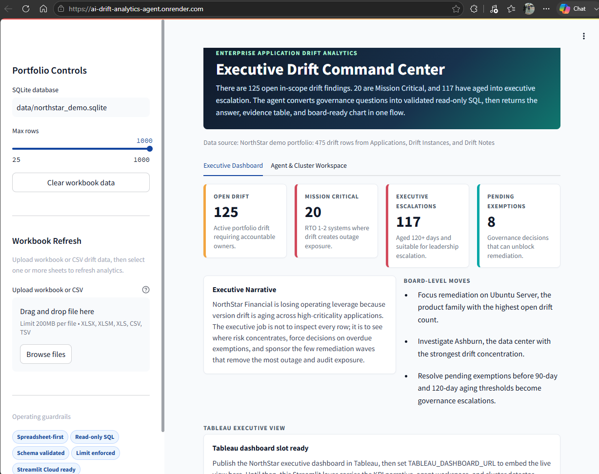
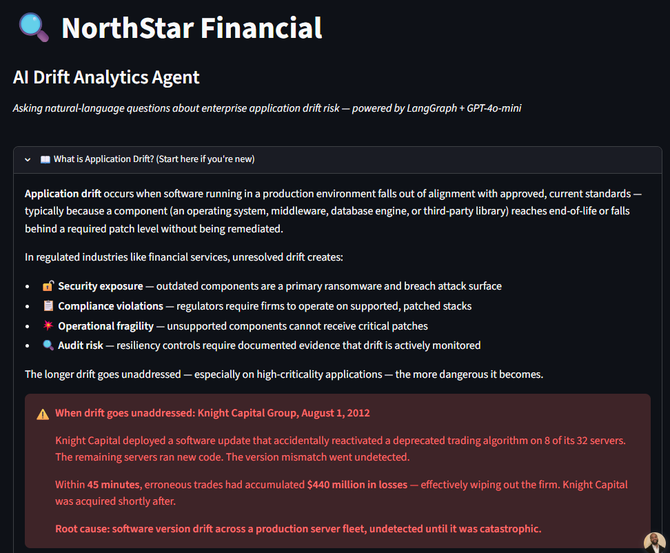
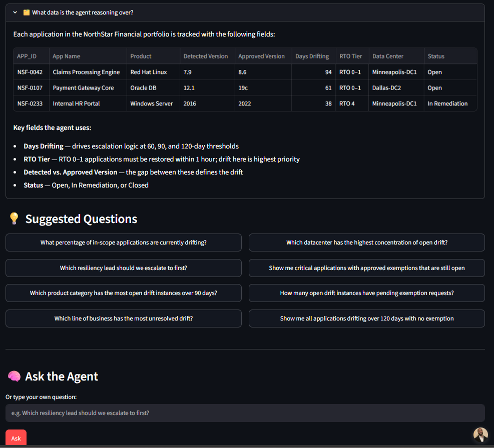

# AI Drift Analytics Agent

Executive dashboard and analytics-agent demo for enterprise application drift risk.

This v2 version opens directly on a bundled NorthStar Financial demo portfolio, so recruiters and reviewers can see the story immediately without uploading a workbook or waking a sleeping free-tier app. The app keeps the original natural-language analytics agent, but reframes the project as an Executive Command Center with Tableau as a board-ready visual layer and cluster detection as a separate analyst lab.

The original v1 Streamlit agent is preserved in the `v1-streamlit-agent` branch/tag. The prior Streamlit Cloud deployment has been retired; v1 is now shown as an archived milestone through source history and screenshots.

## Live Demo

Recruiter-facing app: https://ai-drift-analytics-agent.onrender.com

The live demo runs on Render Starter using the included Docker/Render files. After the Tableau dashboard is published, set `TABLEAU_DASHBOARD_URL` in Render environment variables to embed the live Tableau view inside the Tableau Board View page.



## Project Evolution

### v1: Agent Concept

V1 proved the core idea: an analytics agent could answer natural-language governance questions over a synthetic enterprise application-drift portfolio. It introduced the company story, sample data, suggested prompts, and the risk framing around unremediated software drift.

V1 archive:

- Branch/tag: `v1-streamlit-agent`
- GitHub view: https://github.com/David-P23/ai-drift-analytics-agent/tree/v1-streamlit-agent





### v2: Executive Command Center

V2 reframes the same concept for a recruiter and executive audience. It opens directly on seeded demo data, moves the first impression to executive KPIs, board-level narrative, and an agent input, then provides Tableau and cluster detection as supporting pages.

## What It Does

- Opens with bundled NorthStar demo data from `data/northstar_demo.sqlite`.
- Presents three primary pages:
  - `Executive Command Center`: KPI cards, board narrative, recommended moves, suggested questions, agent answer, SQL evidence, and a compact data/story primer.
  - `Tableau Board View`: embedded Tableau executive dashboard plus a Streamlit fallback risk map.
  - `Cluster Detection Lab`: drift story primer, sample rows, cluster detector, cluster evidence table, and guardrails.
- Detects drift waves when a configurable number of findings emerge within a configurable rolling window for the same product update.
- Supports alternate cluster definitions with plain-English explanations.
- Runs analytics through validated read-only SQLite `SELECT` queries.
- Supports optional workbook/CSV refresh from normalized or flat drift exports.

## Domain Rules

- Drift means `detected_version <> approved_version`.
- `rto_score` 1-2 is Mission Critical.
- `rto_score` 3-4 is High.
- `rto_score` 5-6 is Medium.
- `rto_score` 7-10 is Low.
- Aging thresholds are 60, 90, and 120 days.
- Drift cluster detection defaults to `product + approved_version`, the original "same product update" definition.

## Project Structure

```text
app.py                    Streamlit UI
data/northstar_demo.sqlite Bundled recruiter-demo database
src/agent.py              Agent orchestration and executive summary
src/analytics.py          Reusable drift analytics SQL plans
src/cluster_detection.py  Rolling-window drift cluster detector
src/database.py           SQLite setup and read-only execution
src/domain.py             Domain rules and schema metadata
src/models.py             Pydantic structured response objects
src/prompting.py          Prompt builder and deterministic question routing
src/spreadsheet_import.py Excel workbook normalization and validation
src/sql_safety.py         SQL validation and LIMIT enforcement
tests/                    Safety, import, database, cluster, and smoke tests
```

## Local Setup

```powershell
python -m venv .venv
.\.venv\Scripts\Activate.ps1
python -m pip install --upgrade pip
python -m pip install -r requirements.txt
streamlit run app.py
```

The app defaults to:

```text
DRIFT_DB_PATH=data/northstar_demo.sqlite
SQL_ROW_LIMIT=1000
TABLEAU_DASHBOARD_URL=
```

## Tableau Embed

Publish the Tableau executive dashboard, then configure:

```text
TABLEAU_DASHBOARD_URL=https://public.tableau.com/views/...
```

Until that variable is set, the app shows a professional placeholder plus a fallback Streamlit risk map.

## Workbook Refresh

The sidebar upload flow supports `.xlsx`, `.xlsm`, `.xls`, `.csv`, and `.tsv` files. It can ingest either:

- Flat drift sheets with application name, approved version, detected version, and RTO score.
- Normalized exports with `Applications`, `Drift Instances`, and `Drift Notes`-style sheets joined by `app_id` and `drift_id`.

## Deployment

Recommended for the public portfolio link:

```text
Render Starter
```

The repo includes:

```text
.streamlit/config.toml
.dockerignore
Dockerfile
render.yaml
Procfile
runtime.txt
DEPLOYMENT.md
```

See `DEPLOYMENT.md` for details.

## Tests

```powershell
pytest
```

The suite covers cluster detection, spreadsheet import, SQL safety, prompt routing, database analytics, and Streamlit import smoke behavior.

## Notes

NorthStar Financial is a fictional company and the data is synthetic. This is a portfolio-grade analytics demo, not a production control plane. For a real enterprise deployment, pair the same pattern with service authentication, centralized audit logging, row-level authorization, and governed read-replica access.
